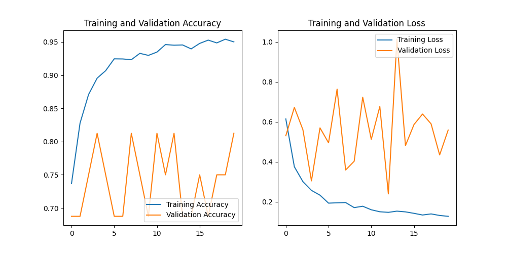

# Проект: Детекция пневмонии на рентгеновских снимках грудной клетки

### Описание проекта
В этом проекте я разработал и обучил сверточную нейронную сеть (CNN) для бинарной классификации рентгеновских снимков грудной клетки. Основная цель — определить наличие пневмонии на изображениях. Проект демонстрирует мои навыки в области Computer Vision, обработки и аугментации данных, а также в применении техник регуляризации для улучшения производительности модели.

### Используемые технологии
* **Язык программирования:** Python
* **Библиотеки:** `TensorFlow`, `Keras`, `NumPy`, `Pandas`, `Matplotlib`
* **Инструменты:** `Git`, `GitHub`

### Используемые данные
Проект использует открытый датасет `Chest X-Ray Images (Pneumonia)` с платформы Kaggle. Датасет содержит более 5000 изображений, разделенных на две категории: `NORMAL` и `PNEUMONIA`, а также на тренировочную, валидационную и тестовую выборки.

### Архитектура модели
Для решения задачи была выбрана простая архитектура сверточной нейронной сети (CNN). Модель состоит из трех сверточных слоев, за которыми следуют слои пулинга для уменьшения размерности. Для предотвращения переобучения были добавлены слои `Dropout`.

Краткая сводка по архитектуре:
* `conv2d`: Сверточный слой с 32 фильтрами
* `max_pooling2d`: Макспулинг для уменьшения размерности
* `dropout`: Слой регуляризации с коэффициентом 0.25
* `conv2d_1`: Сверточный слой с 64 фильтрами
* `max_pooling2d_1`: Макспулинг
* `dropout_1`: Слой регуляризации с коэффициентом 0.25
* `conv2d_2`: Сверточный слой с 128 фильтрами
* `max_pooling2d_2`: Макспулинг
* `dropout_2`: Слой регуляризации с коэффициентом 0.25
* `flatten`: Слой для выпрямления данных
* `dense`: Полносвязный слой с 512 нейронами
* `dropout_3`: Слой регуляризации с коэффициентом 0.5
* `dense_1`: Выходной слой с 1 нейроном (сигмоид)

**Общее количество параметров:** 19,034,177

### Процесс и результаты обучения
Первоначальная версия модели показала признаки сильного переобучения. Точность на тренировочной выборке достигала 95%, в то время как на валидационной она сильно колебалась и была ниже.

Для решения этой проблемы я применил **регуляризацию Dropout**. Были добавлены слои `Dropout` с коэффициентами 0.25 и 0.5. После повторного обучения модели в течение 20 эпох, мне удалось добиться следующих улучшений:
* **Итоговая точность на тестовой выборке:** увеличена с **75% до 80.13%**.
* **Стабильность:** Улучшилась способность модели к обобщению, что позволило получить более надежный результат на ранее не виденных данных.

Графики ниже наглядно демонстрируют процесс обучения и эффект от применения Dropout.

### Графики обучения

### Дальнейшие шаги и улучшения
Проект можно улучшить, используя более продвинутые подходы, такие как:
* **Transfer Learning:** Использование предобученных на больших датасетах моделей (например, VGG16, ResNet50) для извлечения признаков.
* **Тюнинг гиперпараметров:** Оптимизация параметров обучения (learning rate, размер батча, количество эпох) с помощью таких инструментов, как Keras Tuner.